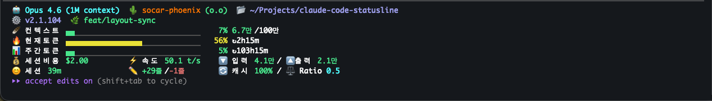

# Claude Code Status Line

[Claude Code](https://docs.anthropic.com/en/docs/claude-code) 터미널에 실시간 세션 메트릭을 표시하는 커스텀 상태바입니다.



## 주요 기능

- **Rate Limits** — 5시간/7일 토큰 사용량 프로그래스 바 + 리셋 시간
- **비용 & 속도** — 세션 누적 비용, 출력 속도 (tokens/sec)
- **토큰 입출력** — 누적 입력/출력 토큰
- **컨텍스트 윈도우** — 사용률 프로그래스 바
- **세션 시간** — 세션 시작 후 경과 시간
- **코드 변경량** — 추가/삭제된 라인 수
- **Git 브랜치** — 현재 브랜치 (git 저장소에서만 표시)
- **Git 사용자** — git user.name 자동 감지 및 표시
- **구간별 색상** — 사용량에 따라 초록/노랑/빨강 자동 변경
- **커스터마이징** — config 파일로 레이아웃 변경, 4개 내장 프리셋, 슬래시 커맨드 지원

## 설치

**macOS / Linux**
```bash
curl -sL https://raw.githubusercontent.com/socar-phoenix/claude-code-statusline/main/install.sh | bash
```

**Windows (PowerShell)**
```powershell
irm https://raw.githubusercontent.com/socar-phoenix/claude-code-statusline/main/install.ps1 | iex
```

설치 후 바로 적용됩니다.

## 색상 임계값

| 항목 | 초록 | 노랑 | 빨강 |
|------|------|------|------|
| Rate Limits | < 50% | 50-80% | 80%+ |
| 비용 | < $20 | $20-50 | $50+ |
| 속도 | 50+ t/s | 20-50 | < 20 |
| 토큰 | < 100K | 100-500K | 500K+ |
| 컨텍스트 | < 50% | 50-80% | 80%+ |
| 세션 시간 | < 1h | 1-3h | 3h+ |

## 삭제

```bash
# 1. 파일 삭제
rm ~/.claude/statusline.js
rm ~/.claude/commands/statusline_customize.md
rm ~/.claude/commands/statusline_validate.md
rm ~/.claude/statusline.config.json  # 커스텀 설정이 있는 경우

# 2. settings.json에서 statusLine 항목 제거
node -e "
  const fs = require('fs');
  const f = require('os').homedir() + '/.claude/settings.json';
  const s = JSON.parse(fs.readFileSync(f, 'utf8'));
  const cmd = s.statusLine && s.statusLine.command || '';
  if (cmd.includes('statusline.js')) {
    delete s.statusLine;
    fs.writeFileSync(f, JSON.stringify(s, null, 2) + '\n');
    console.log('statusLine 설정 제거 완료');
  } else if (cmd) {
    console.log('statusLine이 다른 도구를 가리키고 있어 변경하지 않았습니다');
  } else {
    console.log('statusLine 설정이 없습니다');
  }
"
```

## 커스터마이징

`~/.claude/statusline.config.json` 파일을 생성해 표시 항목과 레이아웃을 변경할 수 있습니다.

### 프리셋 방식

```json
{"preset": "minimal"}
```

| 프리셋 | 줄 수 | 레이아웃 |
|--------|-------|---------|
| `default` | 7줄 | model git_user path / version branch / context / five_hour / seven_day / cost speed io_tokens / session_time code_lines cache_ratio |
| `focus` | 6줄 | model path / branch / context / five_hour / seven_day / cost speed code_lines |
| `compact` | 3줄 | model path branch / context cost / five_hour speed |
| `minimal` | 3줄 | model path branch / context / five_hour |

### 직접 지정 방식

```json
{
  "lines": [
    ["model", "path", "branch"],
    ["context"],
    ["five_hour"]
  ]
}
```

### 사용 가능한 필드

| 타입 | 필드 | 설명 |
|------|------|------|
| inline | `model` | 모델명 |
| inline | `git_user` | git user + 이모지 |
| inline | `path` | 작업 경로 |
| inline | `version` | Claude Code 버전 |
| inline | `branch` | git 브랜치 |
| bar | `context` | 컨텍스트 사용률 |
| bar | `five_hour` | 5시간 토큰 사용률 |
| bar | `seven_day` | 7일 토큰 사용률 |
| column | `cost` | 세션 비용 |
| column | `speed` | 출력 속도 |
| column | `io_tokens` | 입출력 토큰 |
| column | `session_time` | 세션 시간 |
| column | `code_lines` | 코드 변경 줄 수 |
| column | `cache_ratio` | 캐시 히트율 |

> 같은 줄에 `bar` 타입과 `inline`/`column` 타입을 함께 사용할 수 없습니다.
> 허용 조합: `inline` + `inline`, `bar` 단독, `column` + `column`

### config 오류 처리

잘못된 config는 에러 배너를 표시하고 default 레이아웃으로 자동 fallback됩니다.

```
⚠️  statusline config error: unknown preset "typo" — using default
```

### 슬래시 커맨드

설치 스크립트(`install.sh` / `install.ps1`)가 실행 시 `~/.claude/commands/`에 커맨드 파일을 자동 설치합니다.

| 커맨드 | 설명 |
|--------|------|
| `/statusline:customize` | 대화형으로 config 생성/수정 (프리셋 선택 / 편집 / 직접 구성) |
| `/statusline:validate` | 현재 config 유효성 검사 및 레이아웃 미리보기 |

**수동 설치** (커맨드 파일만 별도로 설치할 때):

```bash
mkdir -p ~/.claude/commands
cp .claude/commands/statusline_customize.md ~/.claude/commands/
cp .claude/commands/statusline_validate.md ~/.claude/commands/
```

## 요구사항

- Claude Code CLI
- Node.js (Claude Code에 포함)

## License

MIT
